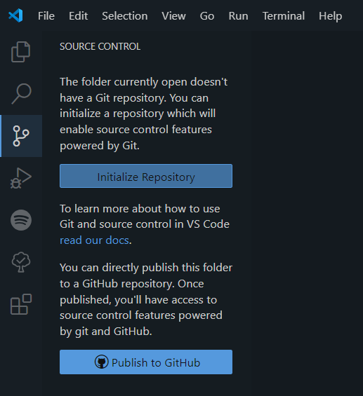
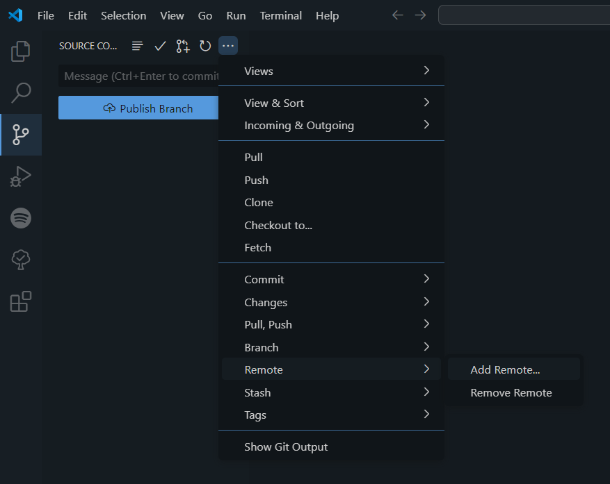
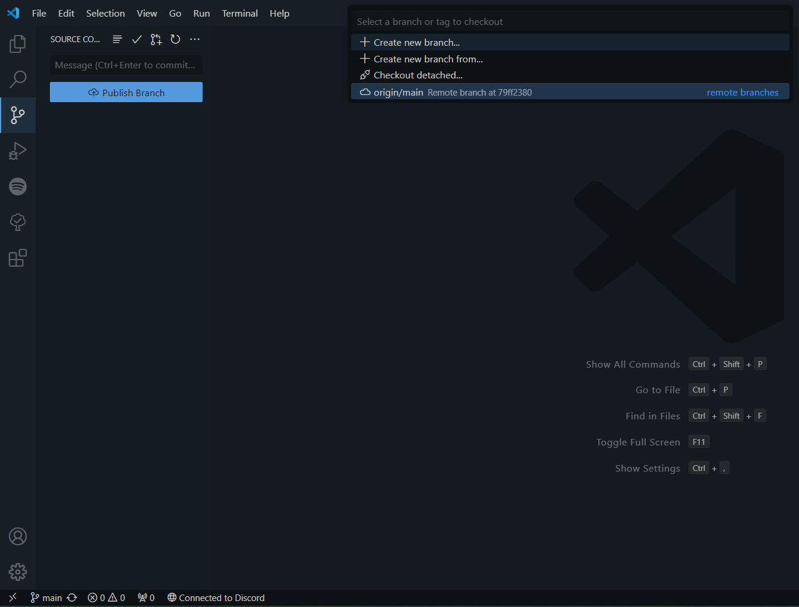
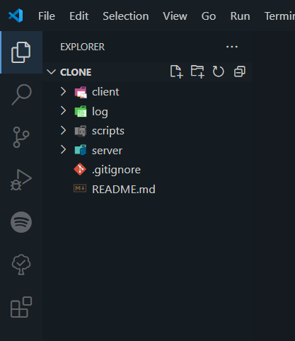

# Werewolf
Welcome to our Werewolf project! We're glad to see you here.
Please, read the ```Quick Start``` section to be able to contribute to this project (setup configuration mostly).

## Quick Start
### 1. Clone this repository on your computer. 

To do so, just click in the code button at the right-top corner of the repo, just below the watch counter. Copy to your clipboard the HTTPS url using the icon. 


On your VSCode with a new empty folder open, select the option of Source Control (it looks like branches on the left) and hit the option ```Initialize Repository```. If git is well configured on your machine, the icon should disappear.



Then, click the three dots in the corner and hit the option ```Remote -> Add Remote```. It will ask you for the url, here's where you paste the one you copied to your clipboard before. Then will ask you for a name. It doesn't really matter, you can just type something standard as ```origin``` and it would do the job. 



In the bottom left corner of your vscode select the branch ```main```. Click on it and select in the box ```<remote>/main``` (in this case, ```origin/main```) and it should automatically start with the pulling of files from GitHub.



After that, you should have the latest version of that branch on your computer. (Check this in the files for that folder).



### 2. Run the test.ps1 script

To ensure you're able to run the Net Blocks provided in the net folders, you might check the execution of ```test.ps1``` script. To run it, just open a Powershell instance on the project folder (could be a terminal on the vscode instance of the previous step) and type:
```ps1
.\scripts\test.ps1
```

If it hit some error it could be related with the previligies of PS to ecxecute PS1 files manually. In that case, please read the output error and try to fix it and try again (you can contact me @buronsuave if you have problems on this one). 

If the script goes well, it should compile both client and server and put the exc files a new folder call ```/.build``` in the same project directory. Then, it will attemot to execute them creating an instance of the server on ```NonBlockingAccept``` mode and three client instances to send a message and then finish their executions (this is, you sould see four command lines prompting to your screen. Please don't be scare, I sware is expected behavior). If you can type a message on each client and send them to the server, you should see through the logs on the server the message you sent (specifically on a sentence that looks like ```Received message: <your_message>```).

If this is the behavior you're seeing, you're done and ready to start contribuiting to this precious code. 

Happy hacking!

## Net Blocks

```TODO``` : Here's where I'm going to upload basic documentation of usage of the developed network blocks for client/server socket implementations.